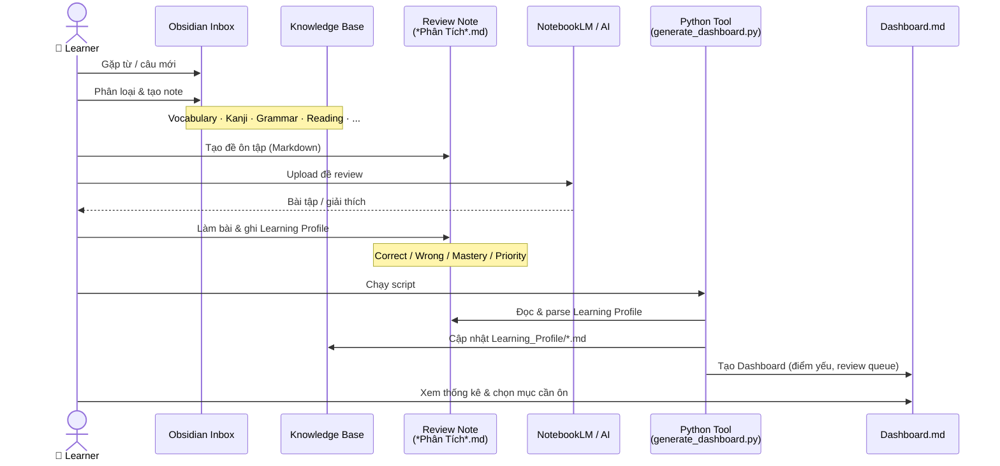
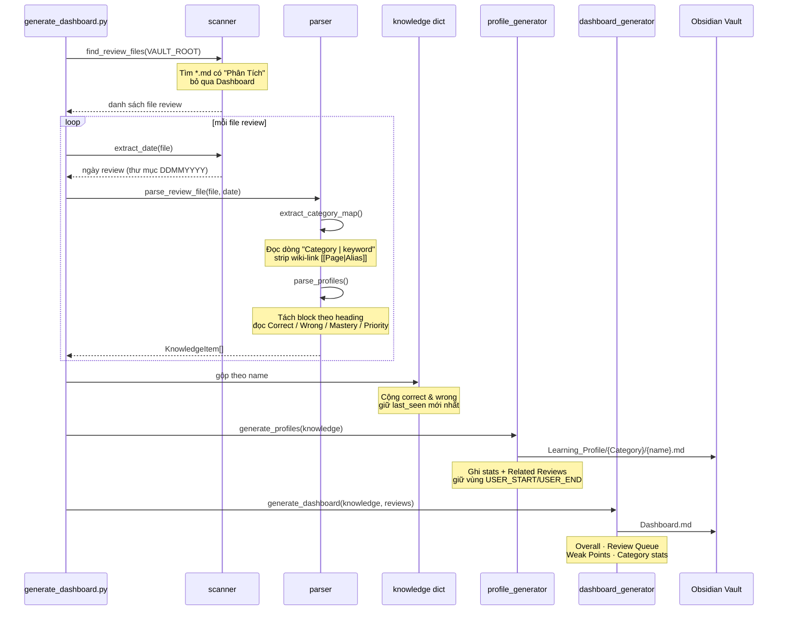
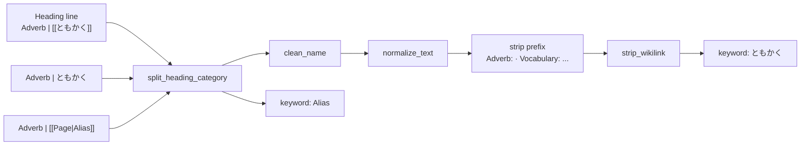

# Japanese Learning Flow

## 1. Learning loop (overview)

## 2. Python tool pipeline

`generate_dashboard.py` quét vault, gộp dữ liệu từ mọi bài review, rồi sinh profile + dashboard.

## 3. Parser detail (keyword extraction)

