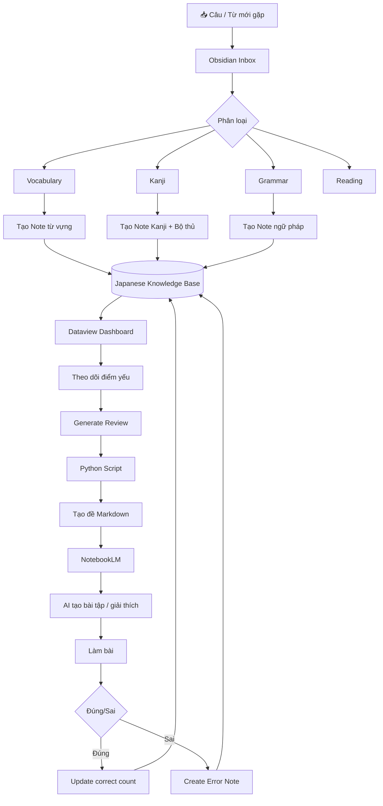

```mermaid
flowchart TD

A[📥 Câu / Từ mới gặp] --> B[Obsidian Inbox]

B --> C{Phân loại}

C --> D[Vocabulary]
C --> E[Kanji]
C --> F[Grammar]
C --> G[Reading]

D --> H[Tạo Note từ vựng]
E --> I[Tạo Note Kanji + Bộ thủ]
F --> J[Tạo Note ngữ pháp]

H --> K[(Japanese Knowledge Base)]
I --> K
J --> K

K --> L[Dataview Dashboard]

L --> M[Theo dõi điểm yếu]
M --> N[Generate Review]

N --> O[Python Script]

O --> P[Tạo đề Markdown]

P --> Q[NotebookLM]

Q --> R[AI tạo bài tập / giải thích]

R --> S[Làm bài]

S --> T{Đúng/Sai}

T -->|Đúng| U[Update correct count]
T -->|Sai| V[Create Error Note]

U --> K
V --> K
```